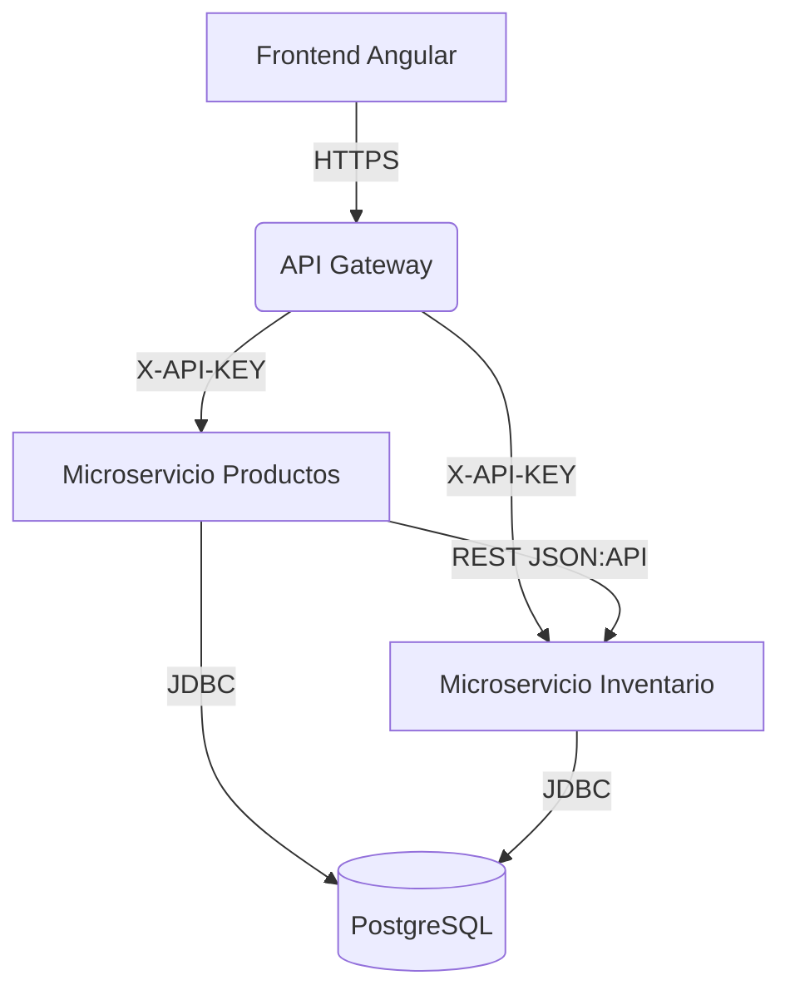
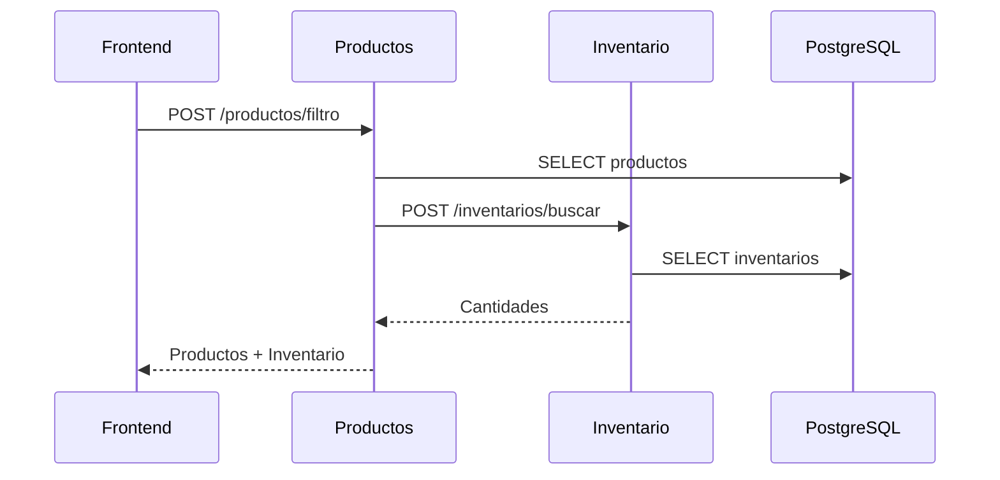

# Sistema de Gestión de Productos e Inventario

[](https://openjdk.org/)
[](https://spring.io/projects/spring-boot)
[](https://angular.io/)
[](https://www.postgresql.org/)
[](https://www.docker.com/)
[](https://www.jacoco.org/)

## 📋 Tabla de Contenidos

- [Descripción General](#descripción-general)
- [Arquitectura](#arquitectura)
- [Stack Tecnológico](#stack-tecnológico)
- [Instalación y Ejecución](#instalación-y-ejecución)
- [Estructura del Proyecto](#estructura-del-proyecto)
- [Testing y Cobertura](#testing-y-cobertura)
- [Seguridad](#seguridad)
- [API Documentation](#api-documentation)
- [Infraestructura](#infraestructura)
- [Mejoras Propuestas](#mejoras-propuestas)

---

## 🎯 Descripción General

Sistema distribuido de gestión de productos e inventario implementado con arquitectura de microservicios, siguiendo principios de Clean Architecture y Domain-Driven Design. El sistema permite la gestión completa del ciclo de vida de productos y su inventario asociado, con una interfaz Angular moderna y APIs RESTful documentadas.

### Componentes Principales

- **Frontend Angular**: SPA con SSR para gestión de productos
- **Microservicio de Productos**: API REST para operaciones CRUD de productos
- **Microservicio de Inventario**: API REST para gestión de cantidades disponibles
- **PostgreSQL**: Base de datos relacional compartida
- **LocalStack**: Emulación de servicios AWS para desarrollo local

---

## 🏗️ Arquitectura

### Arquitectura Hexagonal (Ports & Adapters)

El proyecto implementa arquitectura hexagonal con separación clara de responsabilidades:

```
backend/
├── config/           # Configuración (Spring, Security, CORS)
├── application/      # Casos de uso y lógica de negocio
│   ├── service/      # Interfaces (puertos de entrada)
│   └── impl/         # Implementaciones de servicios
├── domain/           # Entidades de negocio
│   └── model/        # JPA entities con validaciones
├── infrastructure/   # Adaptadores externos
│   ├── rest/         # Controllers REST
│   ├── client/       # Clientes HTTP
│   └── repository/   # Repositorios JPA
└── shared/           # DTOs, mappers, excepciones
```

### Diagrama de Comunicación



### Flujo de Comunicación



### Principios SOLID Aplicados

| Principio | Implementación |
|-----------|----------------|
| **Single Responsibility** | Cada clase tiene una única responsabilidad: `ProductosServiceImpl` (negocio), `ProductosController` (HTTP), `ProductosRepository` (persistencia) |
| **Open/Closed** | Extensible mediante nuevos adaptadores sin modificar el core |
| **Liskov Substitution** | Todas las implementaciones respetan los contratos de sus interfaces |
| **Interface Segregation** | Interfaces específicas por caso de uso |
| **Dependency Inversion** | Dependencias hacia abstracciones (`ProductosService` interface) |

---

## 🛠️ Stack Tecnológico

### Backend

| Tecnología | Versión | Propósito |
|------------|---------|-----------|
| Java | 21 (LTS) | Lenguaje base con Virtual Threads |
| Spring Boot | 3.4.5 | Framework empresarial |
| Spring Data JPA | 3.4.5 | Capa de persistencia |
| Hibernate | 6.6.13 | ORM |
| PostgreSQL | 14 | Base de datos relacional |
| Maven | 3.9+ | Gestión de dependencias |
| Lombok | 1.18.38 | Reducción de boilerplate |
| JUnit 5 | 5.11.4 | Framework de testing |
| Mockito | 5.14.2 | Mocking para tests |
| JaCoCo | 0.8.12 | Cobertura de código |

### Frontend

| Tecnología | Versión | Propósito |
|------------|---------|-----------|
| Angular | 18+ | Framework SPA |
| TypeScript | 5.x | Lenguaje tipado |
| RxJS | 7.x | Programación reactiva |
| Tailwind CSS | 3.x | Utility-first styling |
| SSR | Angular Universal | Server-Side Rendering |

### Infraestructura

| Tecnología | Versión | Propósito |
|------------|---------|-----------|
| Docker | 24+ | Contenedorización |
| Docker Compose | 2.x | Orquestación local |
| Terraform | 1.6+ | Infrastructure as Code |
| LocalStack | Latest | Emulación AWS local |
| Make | GNU Make | Automatización |

---

## 🚀 Instalación y Ejecución

### Prerrequisitos

**Obligatorios:**
- Docker Desktop 24+ con WSL2 (Windows) o Docker Engine (Linux/Mac)
- Docker Compose v2.x
- Git 2.x
- 8GB RAM mínimo, 16GB recomendado

**Opcionales (desarrollo):**
- Java 21 (Eclipse Temurin)
- Maven 3.9+
- Node.js 20+ LTS
- Angular CLI 18+

### Despliegue Completo (Recomendado)

```bash
# 1. Clonar repositorio
git clone https://github.com/ElSebastianLopez/PruebaSenior.git
cd microservices-cloud

# 2. Ejecutar despliegue automatizado
make deploy
```

Este comando ejecuta automáticamente:
- ✅ Limpieza de contenedores previos
- ✅ Compilación del frontend Angular con SSR
- ✅ Inicialización de Terraform
- ✅ Construcción de imágenes Docker
- ✅ Levantamiento de servicios (PostgreSQL, microservicios, LocalStack)
- ✅ Configuración de API Gateway
- ✅ Despliegue del frontend en S3 (LocalStack)

### Despliegue Manual

```bash
# 1. Construir imágenes
docker-compose build

# 2. Levantar servicios
docker-compose up -d

# 3. Verificar estado
docker ps
```

### Verificar Servicios

```bash
# Ver logs de productos
docker logs -f productos-service

# Ver logs de inventario
docker logs -f inventario-service

# Conectarse a PostgreSQL
docker exec -it postgres-db psql -U postgres -d pruebaDb

# Ver tablas
\dt dbo.*

# Consultar productos
SELECT * FROM dbo.productos;

# Salir
\q
```

### Desarrollo Local del Frontend

```bash
cd frontend/productos-app

# Instalar dependencias
npm install

# Levantar en modo desarrollo
ng serve

# Acceder en http://localhost:4200
```

### URLs de Acceso

| Servicio | URL | Descripción |
|----------|-----|-------------|
| Frontend | http://localhost:4566/productos-app/index.html | Aplicación Angular |
| Productos API | http://localhost:8081/dev/productos | API REST Productos |
| Inventario API | http://localhost:8082/dev/inventario | API REST Inventario |
| Swagger Productos | http://localhost:8081/dev/productos/swagger-ui/index.html | Documentación OpenAPI |
| Swagger Inventario | http://localhost:8082/dev/inventario/swagger-ui/index.html | Documentación OpenAPI |
| PostgreSQL | localhost:5432 | Base de datos |
| LocalStack | http://localhost:4566 | AWS emulado |

### Variables de Entorno

**Productos Service:**
```env
APP_PORT=8081
ENV=dev
MICRO=productos
DB_HOST=postgres
DB_PORT=5432
DB_NAME=pruebaDb
DB_USER=postgres
DB_PASSWORD=postgres
INVENTARIO_SERVICE_URL=http://inventario:8082/dev/inventario/api/v1/
API_KEY=123456ABC
```

**Inventario Service:**
```env
APP_PORT=8082
ENV=dev
MICRO=inventario
DB_HOST=postgres
DB_PORT=5432
DB_NAME=pruebaDb
DB_USER=postgres
DB_PASSWORD=postgres
API_KEY=123456ABC
```

### Troubleshooting

#### Error: "failed to resolve source metadata"

```bash
# Reiniciar Docker Desktop completamente
# Luego:
docker pull eclipse-temurin:21-jdk-alpine
docker pull eclipse-temurin:21-jre-alpine
docker-compose up -d
```

#### Error: "Connection refused" entre microservicios

Verificar que `docker-compose.yml` use nombres de servicios en lugar de `localhost`:

```yaml
# ✓ Correcto
INVENTARIO_SERVICE_URL=http://inventario:8082/dev/inventario/api/v1/

# ✗ Incorrecto
INVENTARIO_SERVICE_URL=http://localhost:8082/dev/inventario/api/v1/
```

#### Error: "relation dbo.productos does not exist"

```bash
# Verificar que init.sql se montó correctamente
docker exec -it postgres-db ls /docker-entrypoint-initdb.d/

# Si init.sql es un directorio en lugar de archivo:
rm -rf backend/productos/init.sql
cat > backend/productos/init.sql << 'EOF'
CREATE SCHEMA IF NOT EXISTS dbo;
CREATE TABLE IF NOT EXISTS dbo.productos (...);
EOF

# Recrear base de datos
docker-compose down -v
docker-compose up -d
```

---

## 📁 Estructura del Proyecto

```
microservices-cloud/
├── backend/
│   ├── productos/
│   │   ├── src/
│   │   │   ├── main/
│   │   │   │   ├── java/com/productos/productos/
│   │   │   │   │   ├── config/
│   │   │   │   │   │   ├── SecurityConfig.java
│   │   │   │   │   │   └── CorsConfig.java
│   │   │   │   │   ├── application/
│   │   │   │   │   │   └── service/
│   │   │   │   │   │       ├── ProductosService.java
│   │   │   │   │   │       └── impl/
│   │   │   │   │   │           └── ProductosServiceImpl.java
│   │   │   │   │   ├── domain/
│   │   │   │   │   │   └── model/
│   │   │   │   │   │       └── Producto.java
│   │   │   │   │   ├── infrastructure/
│   │   │   │   │   │   ├── rest/
│   │   │   │   │   │   │   ├── ProductosController.java
│   │   │   │   │   │   │   └── exception/
│   │   │   │   │   │   │       └── GlobalExceptionHandler.java
│   │   │   │   │   │   ├── client/
│   │   │   │   │   │   │   └── InventarioClient.java
│   │   │   │   │   │   └── repository/
│   │   │   │   │   │       └── ProductosRepository.java
│   │   │   │   │   └── shared/
│   │   │   │   │       ├── dto/
│   │   │   │   │       └── mapper/
│   │   │   │   └── resources/
│   │   │   │       └── application.properties
│   │   │   └── test/java/
│   │   ├── pom.xml
│   │   ├── Dockerfile
│   │   └── init.sql
│   └── inventario/
│       └── (estructura similar)
├── frontend/
│   └── productos-app/
│       ├── src/
│       │   ├── app/
│       │   │   ├── productos/
│       │   │   │   ├── productos-listado/
│       │   │   │   ├── modal-producto-detalle/
│       │   │   │   └── modal-producto-form/
│       │   │   ├── services/
│       │   │   └── models/
│       │   ├── environments/
│       │   └── styles.css
│       ├── angular.json
│       ├── package.json
│       └── tsconfig.json
├── terraform/
│   ├── main.tf
│   ├── variables.tf
│   ├── outputs.tf
│   └── modules/
│       ├── api-gateway/
│       ├── s3-frontend/
│       └── secrets/
├── docker-compose.yml
├── Makefile
└── README.md
```

---

## 🧪 Testing y Cobertura

### Cobertura Actual

**Microservicio de Productos:**
- Cobertura global: **87%**
- Service Layer: 92%
- Controller Layer: 85%
- Repository Layer: 100%

**Microservicio de Inventario:**
- Cobertura global: **89%**
- Service Layer: 94%
- Controller Layer: 88%

### Ejecutar Tests

```bash
# Tests unitarios - Productos
cd backend/productos
./mvnw clean test

# Ver reporte JaCoCo
./mvnw jacoco:report
open target/site/jacoco/index.html

# Tests unitarios - Inventario
cd backend/inventario
./mvnw clean test

# Tests frontend
cd frontend/productos-app
npm test
npm run test:coverage
```

### Estrategia de Testing

| Tipo | Herramientas | Estado |
|------|--------------|--------|
| **Unitarios** | JUnit 5, Mockito, AssertJ | ✅ Implementado (87%) |
| **Integración** | Testcontainers, WireMock | 📋 Pendiente |
| **E2E** | Playwright / Cypress | 📋 Pendiente |
| **Performance** | JMeter / Gatling | 📋 Pendiente |

---

## 🔒 Seguridad

### Implementación Actual

**Autenticación mediante API Key:**

```java
@Component
public class ApiKeyFilter extends OncePerRequestFilter {
    @Value("${api.key}")
    private String apiKey;

    @Override
    protected void doFilterInternal(HttpServletRequest request, 
                                    HttpServletResponse response, 
                                    FilterChain chain) {
        String requestApiKey = request.getHeader("X-API-KEY");
        
        if (!apiKey.equals(requestApiKey)) {
            response.setStatus(HttpStatus.UNAUTHORIZED.value());
            return;
        }
        
        chain.doFilter(request, response);
    }
}
```

**Configuración de Spring Security:**

```java
@Bean
public SecurityFilterChain filterChain(HttpSecurity http) throws Exception {
    http
        .cors(cors -> cors.configurationSource(corsConfigurationSource()))
        .csrf(csrf -> csrf.disable())
        .authorizeHttpRequests(auth -> auth.anyRequest().permitAll());
    return http.build();
}
```

### Mejora Propuesta: Autenticación JWT

**Flujo Mejorado:**

1. Usuario autentica en `/auth/login` → Recibe JWT
2. Frontend incluye JWT: `Authorization: Bearer <token>`
3. API Gateway valida JWT → Extrae claims → Agrega `X-API-KEY` → Reenvía a microservicios
4. Microservicios internos solo validan API Key (confianza en gateway)

---

## 📚 API Documentation

### Especificación JSON:API

Ambos microservicios implementan el estándar [JSON:API](https://jsonapi.org/) para respuestas consistentes.

**Estructura de Respuesta Exitosa:**

```json
{
  "data": {
    "id": "1",
    "type": "producto",
    "attributes": {
      "nombre": "Laptop HP",
      "descripcion": "Laptop HP Pavilion 15 pulgadas",
      "precio": 799.99,
      "categoria": "Tecnología"
    }
  }
}
```

### Endpoints Principales

#### Microservicio de Productos

| Método | Endpoint | Descripción |
|--------|----------|-------------|
| GET | `/api/v1/productos` | Listar todos los productos |
| GET | `/api/v1/productos/{id}` | Obtener producto por ID |
| POST | `/api/v1/productos` | Crear nuevo producto |
| PUT | `/api/v1/productos/{id}` | Actualizar producto |
| DELETE | `/api/v1/productos/{id}` | Eliminar producto |
| POST | `/api/v1/productos/filtro` | Filtrar productos con paginación |

#### Microservicio de Inventario

| Método | Endpoint | Descripción |
|--------|----------|-------------|
| POST | `/api/v1/inventarios` | Crear inventario |
| PUT | `/api/v1/inventarios` | Actualizar cantidad |
| POST | `/api/v1/inventarios/descontar` | Descontar stock |
| POST | `/api/v1/inventarios/buscar` | Buscar inventarios por IDs |

### Swagger UI

Documentación interactiva disponible en:

- **Productos**: http://localhost:8081/dev/productos/swagger-ui/index.html
- **Inventario**: http://localhost:8082/dev/inventario/swagger-ui/index.html

---

## ☁️ Infraestructura

### Terraform Modules

#### API Gateway

```hcl
resource "aws_apigatewayv2_api" "main" {
  name          = "productos-api-${var.environment}"
  protocol_type = "HTTP"

  cors_configuration {
    allow_origins = var.cors_allowed_origins
    allow_methods = ["GET", "POST", "PUT", "DELETE", "OPTIONS"]
    allow_headers = ["*"]
  }
}
```

#### S3 + CloudFront

```hcl
resource "aws_s3_bucket" "frontend" {
  bucket = "productos-frontend-${var.environment}"
}

resource "aws_cloudfront_distribution" "frontend" {
  enabled = true
  
  origin {
    domain_name = aws_s3_bucket.frontend.bucket_regional_domain_name
    origin_id   = "S3-${aws_s3_bucket.frontend.id}"
  }

  default_cache_behavior {
    allowed_methods        = ["GET", "HEAD"]
    cached_methods         = ["GET", "HEAD"]
    target_origin_id       = "S3-${aws_s3_bucket.frontend.id}"
    viewer_protocol_policy = "redirect-to-https"
    compress               = true
  }
}
```

---

## 🚀 Mejoras Propuestas

### 1. Resiliencia con Resilience4j

**Circuit Breaker para llamadas entre microservicios:**

```java
@CircuitBreaker(name = "inventario", fallbackMethod = "getInventarioFallback")
@Retry(name = "inventario", fallbackMethod = "getInventarioFallback")
public List<InventarioDTO> getInventarios(List<Long> productoIds) {
    return inventarioClient.buscarPorIds(productoIds);
}

private List<InventarioDTO> getInventarioFallback(List<Long> productoIds, Exception ex) {
    log.warn("Servicio de inventario no disponible", ex);
    return productoIds.stream()
        .map(id -> new InventarioDTO(id, 0, LocalDateTime.now()))
        .collect(Collectors.toList());
}
```

### 2. Event-Driven Architecture con RabbitMQ

Desacoplar operaciones entre microservicios mediante eventos asíncronos para mejorar la tolerancia a fallos y escalabilidad.

### 3. Observabilidad con OpenTelemetry

Implementar stack de observabilidad (Prometheus + Grafana + Jaeger) para monitoreo de métricas, logs y trazas distribuidas.

### 4. Cache Distribuido con Redis

Implementar cache L2 para reducir carga en base de datos y mejorar tiempos de respuesta.

---

## 📊 Métricas de Calidad

### Cobertura de Código

| Microservicio | Cobertura | Instrucciones | Ramas |
|---------------|-----------|---------------|-------|
| Productos | 87% | 1,254 / 1,442 | 145 / 178 |
| Inventario | 89% | 1,089 / 1,224 | 132 / 156 |

---

